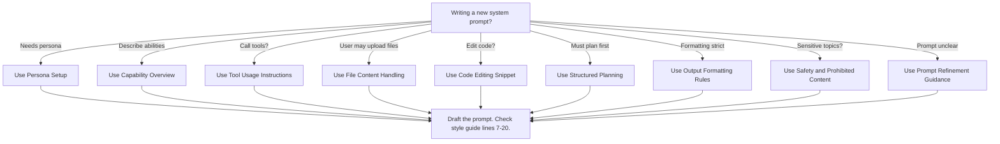

# Prompt Design Playbook

This playbook helps you choose common prompt patterns quickly. Each pattern comes from `Prompt_Pattern_Catalog.md`.

## Quick Reference Table

| Problem type | Recommended patterns | Evaluation method |
| ------------ | ------------------- | ----------------- |
| Need a consistent persona | Persona Setup | Check the persona lines follow your established identity and stay concise. |
| List abilities or limits | Capability Overview | Verify the bullet list covers allowed tasks and states what you cannot do. |
| Explain how to call tools | Tool Usage Instructions | Ensure you show the exact XML tags or syntax required. |
| Handle uploaded files | File Content Handling | Confirm you describe default actions when a file is present. |
| Edit existing code | Code Editing Snippet Pattern | Provide diffs that show only changed lines. |
| Plan before acting | Structured Planning and Reasoning | Use a `<think>` section to outline steps before execution. |
| Enforce consistent output | Output Formatting Rules | Review headings, lists and tables for the required Markdown style. |
| Mention safety rules | Safety and Prohibited Content | Include clear statements about disallowed topics. |
| Improve unclear prompts | Prompt Refinement Guidance | Show the refined prompt only or ask clarifying questions. |

## Simple Decision Flow

Consult the table or follow the flow to pick the right pattern. Always review your draft with the style guide checklist.
